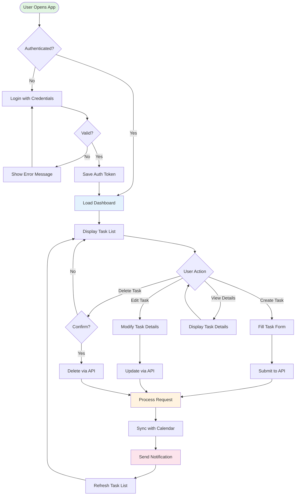
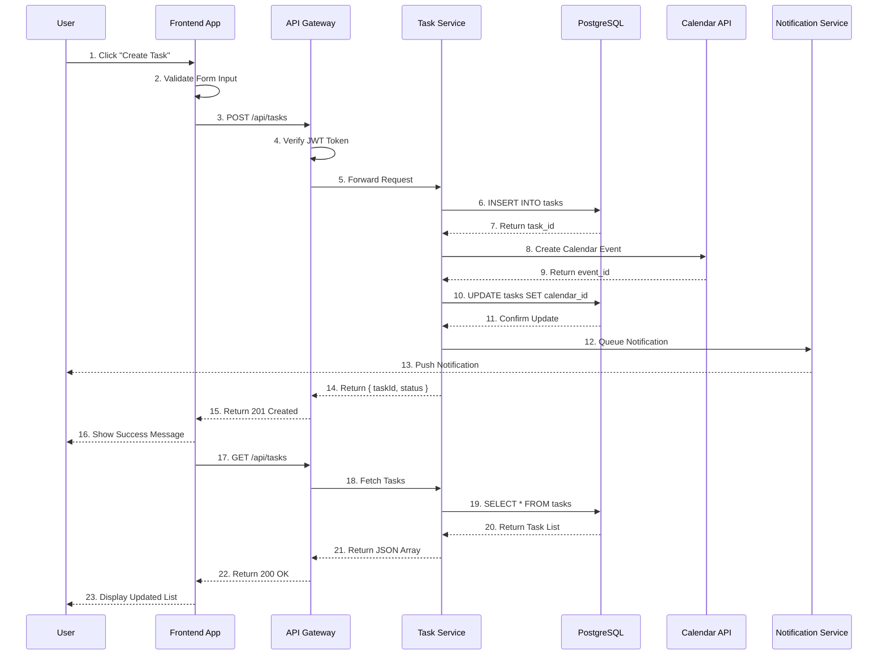
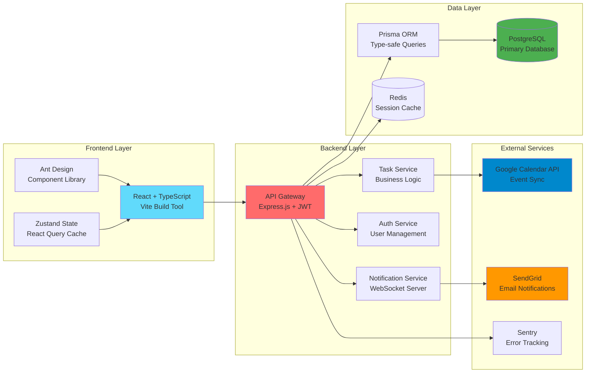

# Complete Documentation Example

This example demonstrates how to create comprehensive project documentation using the three core Mermaid diagram types.

## Example Project: Task Management API

A RESTful API service for managing tasks with user authentication, real-time notifications, and external calendar integration.

---

## 1. Core Flow Diagram - User Operation Flow

Shows how users interact with the system from login to task completion.



**Key Features Shown:**
- Authentication flow with error handling
- Multiple user actions (CRUD operations)
- External service integration (calendar sync)
- Notification system
- Circular flow back to dashboard

---

## 2. Data Flow Diagram - System Interaction Sequence

Shows the complete request-response cycle between system components.



**Key Interactions Shown:**
- Frontend validation before API call
- Authentication middleware (JWT verification)
- Database transactions
- External service integration (Calendar API)
- Asynchronous notification system
- Data refresh after mutation

---

## 3. Technical Architecture Diagram - System Layered Structure

Shows the complete tech stack and dependencies between layers.



**Architecture Highlights:**
- Clear separation of concerns (Frontend, Backend, Data, External)
- Specific technology choices labeled
- Dependency flow from top to bottom
- Color coding for different layer types

---

## GitHub Compatibility Notes

### Common Rendering Issues

**Problem**: `Could not find a suitable point for the given distance`

**Cause**: Using `subgraph "Name"` syntax with quotes

**Solution**: Use `subgraph ID[Name]` syntax instead

```diff
- subgraph "Frontend Layer"
+ subgraph FrontendLayer[Frontend Layer]
```

### Best Practices for GitHub

1. **Avoid quoted subgraph names** - Use ID-based syntax
2. **Keep diagrams under 20 nodes** - Split complex diagrams
3. **Test locally first** - Use Mermaid Live Editor
4. **Use standard shapes** - Stick to documented node types
5. **Limit nesting depth** - Avoid deeply nested subgraphs

---

## Usage in README

### Recommended Structure

```markdown
# Task Management API

A RESTful API for managing tasks with real-time sync and notifications.

## Features
- User authentication with JWT
- CRUD operations for tasks
- Google Calendar integration
- Real-time notifications
- PostgreSQL database with Redis caching

## System Architecture

### User Operation Flow
[Insert Core Flow Diagram]

### API Request Flow
[Insert Data Flow Diagram]

### Technical Stack
[Insert Architecture Diagram]

## Quick Start
[Installation and setup instructions]

## API Documentation
[Endpoint details]
```

---

## Customization Guide

### Adapting for Your Project

1. **Core Flow Diagram**
   - Replace "Task" with your domain entity
   - Adjust decision points for your business logic
   - Add/remove user actions as needed

2. **Data Flow Diagram**
   - Update participant names to match your services
   - Adjust sequence numbers for your flow
   - Add/remove external services

3. **Architecture Diagram**
   - Replace tech stack labels with your choices
   - Adjust layer groupings for your architecture
   - Update colors to match your preferences

### Color Palette Reference

```
Start/Success:     #e1f5e1 (light green)
User Interface:    #e3f2fd (light blue)
Processing:        #fff3e0 (light orange)
Notifications:     #fce4ec (light pink)
Frontend Tech:     #61dafb (React blue)
Backend Tech:      #ff6b6b (red)
Database:          #4caf50 (green)
External Services: #0088cc (blue), #ff9800 (orange)
```
