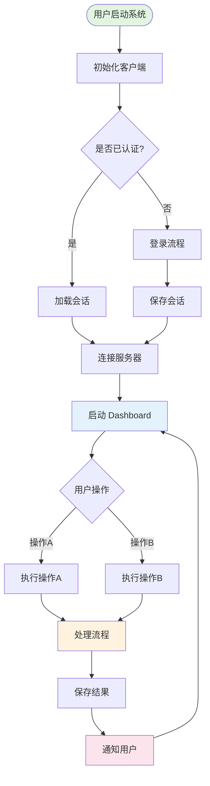
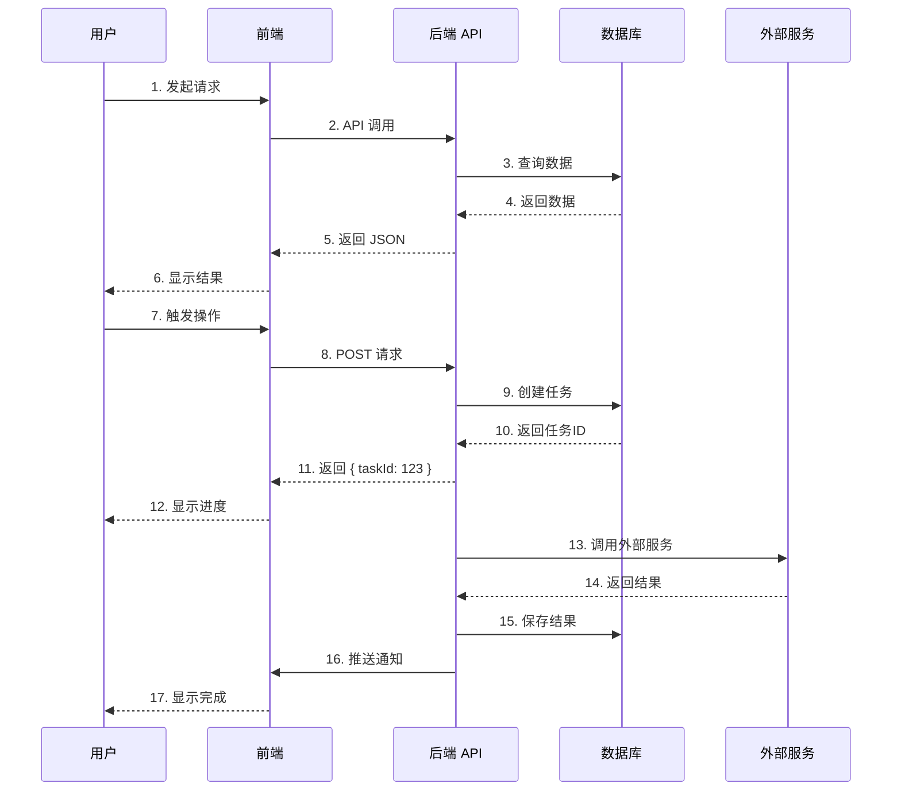
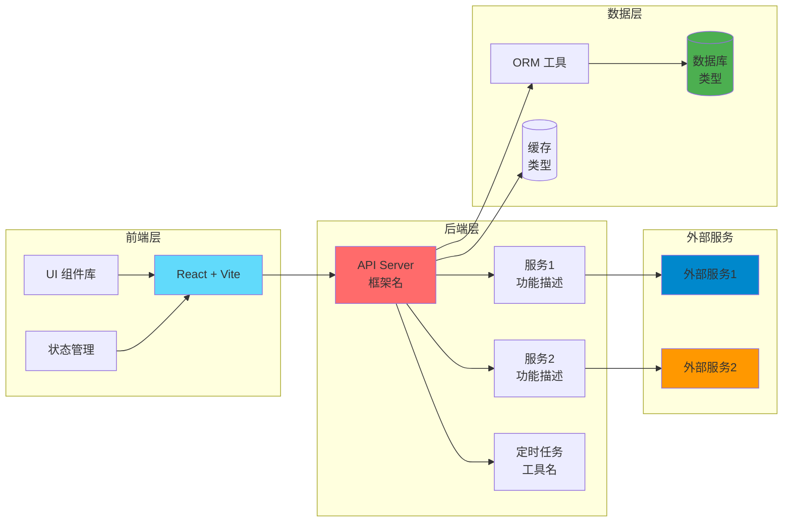

# Mermaid 流程图设计模式

## 核心流程图（用户操作流程）

### 用途
展示用户从启动系统到完成核心任务的完整流程，包括决策点和分支路径。

### 设计原则
1. **自上而下**：从用户启动开始，到核心功能完成结束
2. **决策节点**：使用菱形表示关键决策点（如"是否已登录？"）
3. **状态节点**：使用圆角矩形表示操作步骤
4. **颜色编码**：使用不同颜色区分不同类型的节点

### 模板

### 关键元素
- `([文本])`：圆形起点/终点
- `[文本]`：矩形操作节点
- `{文本}`：菱形决策节点
- `-->|标签|`：带标签的箭头
- `style 节点名 fill:#颜色`：节点着色

---

## 数据流向图（系统交互时序）

### 用途
展示系统各组件之间的交互顺序和数据流动，清晰呈现请求-响应模式。

### 设计原则
1. **参与者分层**：从用户到前端、后端、数据库、外部服务
2. **序号标注**：为每个交互步骤添加序号
3. **同步/异步**：使用实线表示同步，虚线表示异步
4. **分组逻辑**：将相关的交互步骤分组

### 模板

### 关键元素
- `participant X as 名称`：定义参与者
- `->>`：实线箭头（同步调用）
- `-->>`：虚线箭头（返回/异步）
- `序号. 描述`：为每个交互添加序号和描述

---

## 技术架构图（系统分层结构）

### 用途
展示系统的技术栈和各层之间的依赖关系，帮助理解整体架构。

### 设计原则
1. **分层清晰**：前端层、后端层、数据层、外部服务层
2. **技术标注**：在节点中标注具体技术栈
3. **依赖方向**：箭头表示依赖关系
4. **颜色区分**：不同层使用不同颜色

### 模板

### 关键元素
- `subgraph "名称"`：定义分组
- `[文本 换行]`：节点内换行
- `[(文本)]`：圆柱形（数据库）
- `-->`：依赖箭头
- `style 节点名 fill:#颜色`：节点着色

---

## 最佳实践

### 1. 节点命名
- 使用简洁的中文描述
- 避免过长的文本（超过 20 字考虑换行）
- 使用 ` ` 进行换行

### 2. 颜色选择
- 起点/成功：绿色系 `#e1f5e1`
- 用户界面：蓝色系 `#e3f2fd`
- 处理/计算：橙色系 `#fff3e0`
- 通知/结果：粉色系 `#fce4ec`
- 数据库：深绿色 `#4caf50`
- 外部服务：橙色 `#ff9800`

### 3. 复杂度控制
- 单个图表不超过 20 个节点
- 超过 20 个节点考虑拆分为多个图表
- 使用 subgraph 对相关节点分组

### 4. 可读性优化
- 保持箭头方向一致（自上而下或从左到右）
- 避免交叉线
- 使用空行分隔逻辑块
