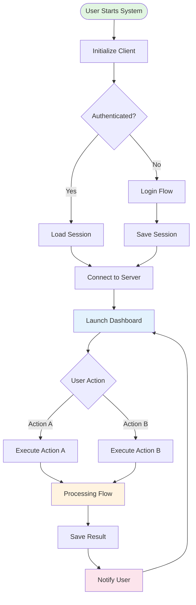
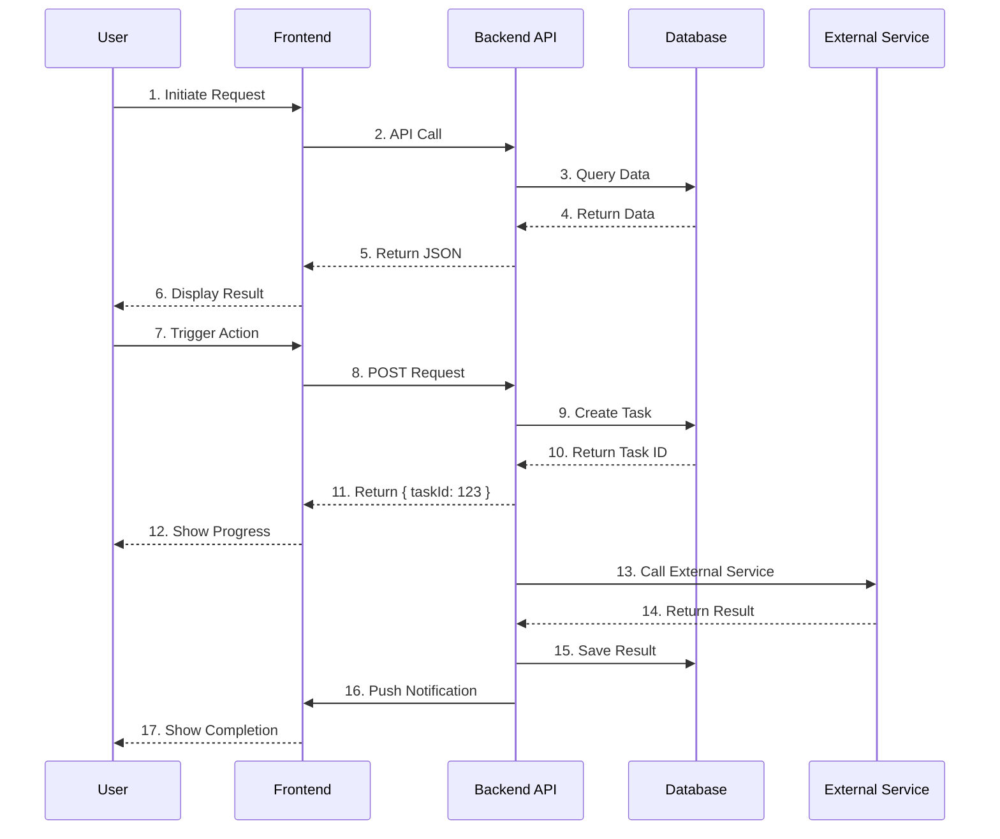
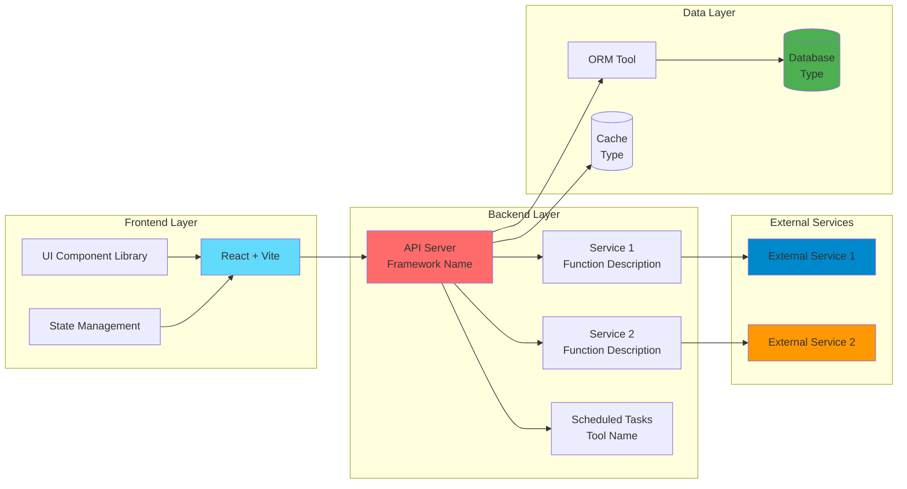

# Mermaid Flowchart Design Patterns

## Core Flow Diagram (User Operation Flow)

### Purpose
Show the complete flow from user starting the system to completing core tasks, including decision points and branch paths.

### Design Principles
1. **Top-Down**: From user startup to core function completion
2. **Decision Nodes**: Use diamonds for key decision points (e.g., "Is user authenticated?")
3. **State Nodes**: Use rounded rectangles for operation steps
4. **Color Coding**: Use different colors to distinguish different types of nodes

### Template

### Key Elements
- `([text])`: Circular start/end point
- `[text]`: Rectangular operation node
- `{text}`: Diamond decision node
- `-->|label|`: Labeled arrow
- `style nodeName fill:#color`: Node coloring

---

## Data Flow Diagram (System Interaction Sequence)

### Purpose
Show interaction sequence and data flow between system components, clearly presenting request-response patterns.

### Design Principles
1. **Participant Layering**: From user to frontend, backend, database, external services
2. **Sequence Numbering**: Add sequence numbers to each interaction step
3. **Sync/Async**: Use solid lines for synchronous, dashed lines for asynchronous
4. **Logical Grouping**: Group related interaction steps

### Template

### Key Elements
- `participant X as Name`: Define participant
- `->>`: Solid arrow (synchronous call)
- `-->>`: Dashed arrow (return/asynchronous)
- `Number. Description`: Add sequence number and description to each interaction

---

## Technical Architecture Diagram (System Layered Structure)

### Purpose
Show system tech stack and dependencies between layers, helping understand overall architecture.

### Design Principles
1. **Clear Layering**: Frontend layer, backend layer, data layer, external services layer
2. **Technology Labels**: Label specific tech stack in nodes
3. **Dependency Direction**: Arrows indicate dependency relationships
4. **Color Differentiation**: Different layers use different colors

### Template

### Key Elements
- `subgraph ID[Name]`: Define grouping (use ID without quotes for better GitHub compatibility)
- `[Text Newline]`: Line break within node
- `[(Text)]`: Cylinder shape (database)
- `-->`: Dependency arrow
- `style nodeName fill:#color`: Node coloring

---

## Best Practices

### 1. Node Naming
- Use concise descriptions
- Avoid overly long text (consider line breaks for text over 20 characters)
- Use ` ` for line breaks

### 2. Color Selection
- Start/Success: Green tones `#e1f5e1`
- User Interface: Blue tones `#e3f2fd`
- Processing/Computing: Orange tones `#fff3e0`
- Notification/Result: Pink tones `#fce4ec`
- Database: Dark green `#4caf50`
- External Services: Orange `#ff9800`

### 3. Complexity Control
- Single diagram should not exceed 20 nodes
- Consider splitting into multiple diagrams if exceeding 20 nodes
- Use subgraph to group related nodes

### 4. Readability Optimization
- Keep arrow direction consistent (top-down or left-right)
- Avoid crossing lines
- Use blank lines to separate logical blocks
