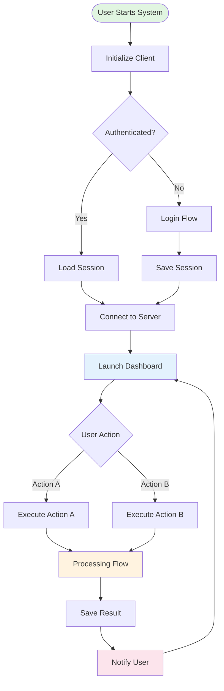
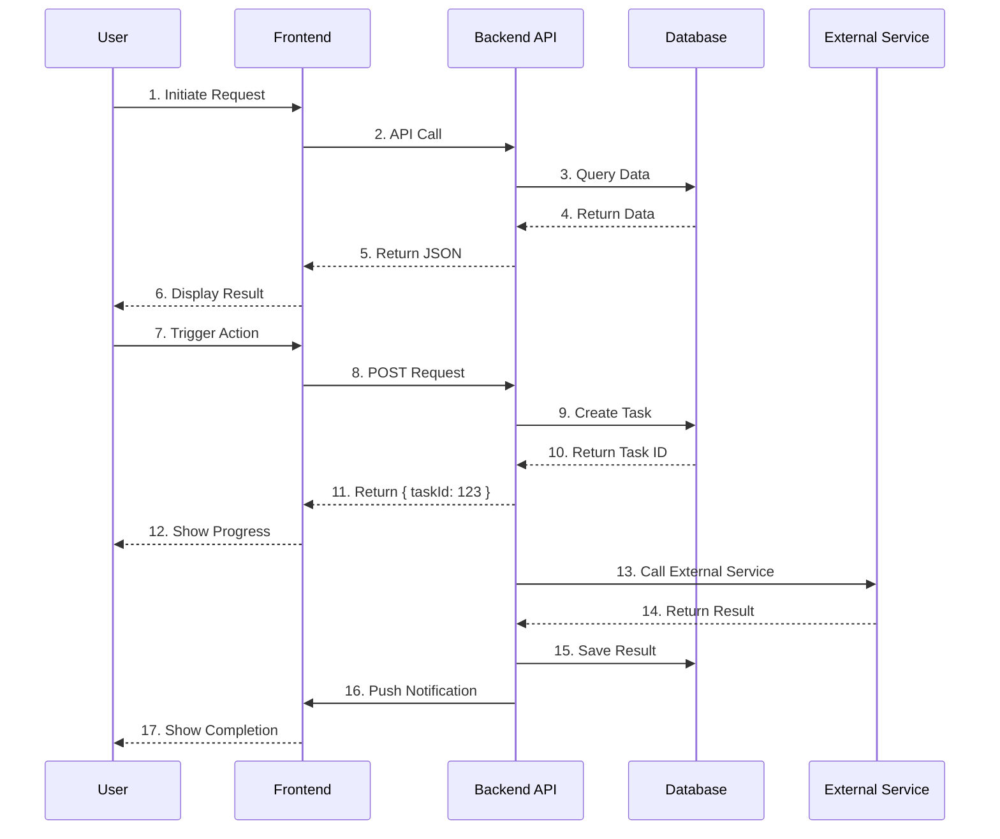
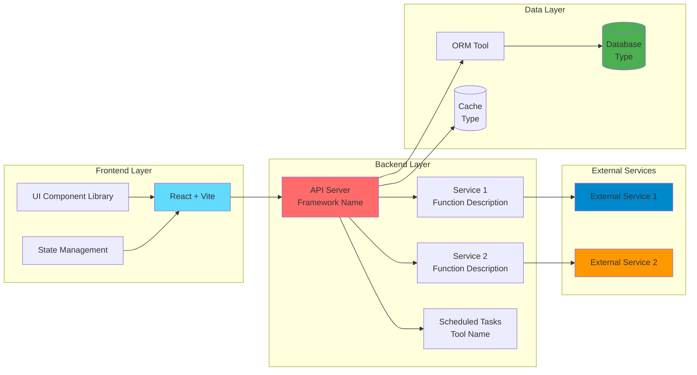

# Mermaid 图表测试

## 测试 1: 核心流程图

## 测试 2: 数据流程图

## 测试 3: 技术架构图（修复后）

## 修复说明

**问题原因**：GitHub 的 Mermaid 渲染器对 `subgraph "Name"` 语法支持不完善，会导致 "Could not find a suitable point for the given distance" 错误。

**解决方案**：使用 `subgraph ID[Name]` 语法替代 `subgraph "Name"`，这样可以：
1. 避免引号导致的解析问题
2. 提供明确的节点 ID
3. 提高 GitHub 渲染兼容性

**修改内容**：
- `subgraph "Frontend Layer"` → `subgraph FrontendLayer[Frontend Layer]`
- `subgraph "Backend Layer"` → `subgraph BackendLayer[Backend Layer]`
- `subgraph "Data Layer"` → `subgraph DataLayer[Data Layer]`
- `subgraph "External Services"` → `subgraph ExternalServices[External Services]`
